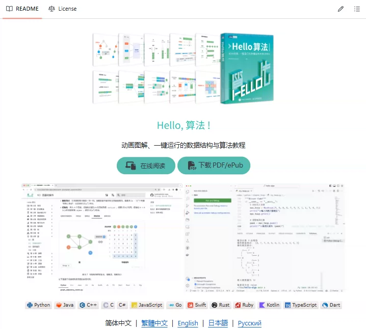
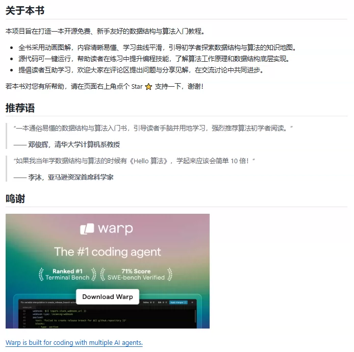
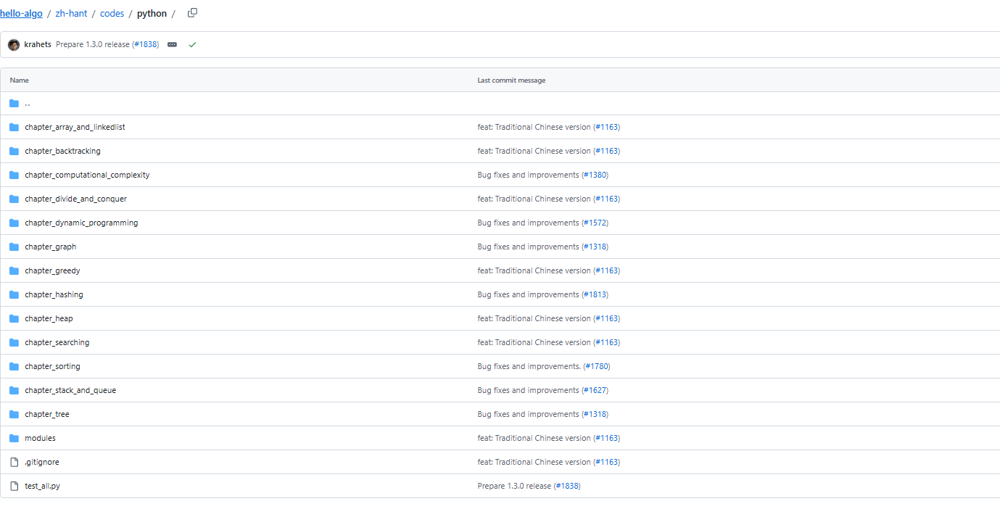

## Body

GitHub High-Star Project Sharing | "Hello Algorithm"

"Hello Algorithm": An animated diagram and a one-click running data structure and algorithm tutorial.

Supports Simplified Chinese, Traditional Chinese, English, Japanese, and provides code implementation in Python, Java, C++, C, C#, JS, Go, Swift, Rust, Ruby, Kotlin, TS, Dart, etc.

Electronic virtual products are not eligible for returns or exchanges.

## Images

Here is a pay link on Stripe ( https://buy.stripe.com/3cs8yP7sY87d0vu9AB ). Please contact me lonlonago@foxmail.com after funding $89, and I will send you a complete data files , thank you!

